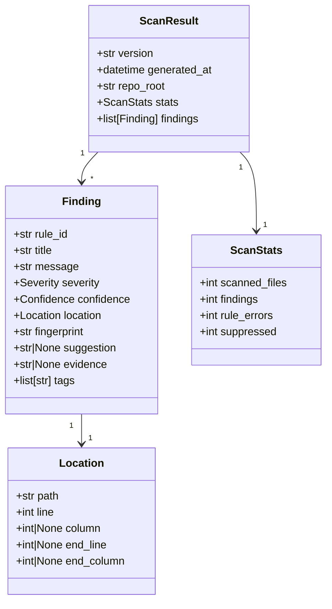
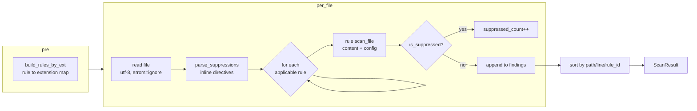
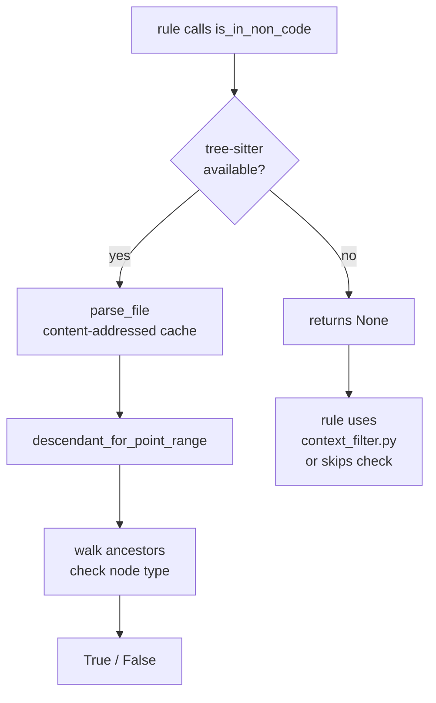

# Architecture

## Problem statement

We want a tool that catches common AI-style code failures in pull requests without relying on an LLM or a backend service.

The scanner should be cheap to run, easy to understand, and safe to execute on untrusted pull requests.

## Core position

This project does **not** try to infer whether code was generated by an LLM.

It focuses on deterministic signals that often correlate with AI-assisted mistakes or rushed edits:

- placeholders left in source
- broken architectural boundaries
- unsafe import patterns
- wide exception handling
- hardcoded secrets and insecure defaults
- AI conversational artifacts in source files
- language-specific antipatterns (JS, Go, Python, TypeScript)

## Design goals

- deterministic by default
- explainable findings
- low operational complexity
- low false-positive tolerance
- GitHub-first ergonomics
- no backend for v1
- strong handoff to coding agents and human maintainers

## Non-goals for v1

- organization-wide dashboards
- multi-repository coordination
- central storage
- web UI
- probabilistic "quality scores"
- model-based semantic review

## Runtime model

```mermaid
flowchart TD
    A[GitHub Actions: checkout] --> B[ai-slopcheck scan]
    B --> C{--changed-files?}
    C -- yes --> D[git diff / @file.txt]
    C -- no --> E[full repo walk]
    D --> F[discover_files]
    E --> F
    F --> G[ThreadPoolExecutor\nmax workers = min\(cpu_count, 8\)]
    G --> H[per-file: parse suppressions\nrun applicable rules]
    H --> I[findings.json]
    I --> J[summary command\nMarkdown]
    I --> K[github-annotations\n::warning/error::]
    I --> L[sarif command\nSARIF v2.1.0]
    I --> M[exit code\nfail-on threshold]
```

A future hardened topology may split this into two workflows:

1. an untrusted scan workflow on `pull_request` (no secrets, no write permissions)
2. an optional trusted workflow on `workflow_run` that posts comments

## Package structure

```text
slopcheck/
├── cli.py                   Entry point (Typer). scan / summary / github-annotations / sarif / create-baseline
├── config.py                YAML config loading + 40 typed Pydantic config models
├── models.py                Finding, Location, ScanResult, ScanStats — the stable contract
├── engine/
│   ├── scanner.py           Orchestrator: file discovery, threading, suppression, rule dispatch
│   ├── repo_files.py        File discovery, extension filtering, symlink safety, dedup
│   ├── suppression.py       Inline slopcheck: ignore[rule] parser
│   └── context_filter.py   Single-pass string/comment/regex context detector (no deps)
├── parsers/
│   └── treesitter.py        Optional tree-sitter adapter with content-addressable parse cache
├── rules/
│   ├── base.py              Abstract Rule base class, build_finding(), fingerprint()
│   ├── registry.py          build_rules() — returns all 42 active rule instances
│   ├── generic/             41 cross-repo rules
│   └── repo/                1 architecture-specific rule (forbidden_import_edges)
├── output/
│   ├── annotations.py       GitHub workflow annotation renderer (::warning file=…::)
│   ├── markdown_summary.py  Markdown summary for GITHUB_STEP_SUMMARY
│   └── sarif.py             SARIF v2.1.0 renderer for GitHub Security tab
├── state/
│   └── store.py             Baseline load/write (fingerprint-based suppression)
└── github/                  (reserved for future GitHub runtime helpers)
```

## Data model



The `Finding` model is the stability contract. Changes here break downstream consumers (baseline files, SARIF output, annotation renderers).

Fingerprints are `sha256(rule_id\x00path\x00line\x00evidence)` — stable enough for baselines, scoped enough to avoid collisions.

## Rule execution pipeline



Rules are pre-filtered by extension before scanning: a Go rule never runs on `.py` files. Rules with `supported_extensions = None` run on all `DEFAULT_CODE_EXTENSIONS`.

## Threading model

The scanner uses `concurrent.futures.ThreadPoolExecutor` for file-level parallelism.

| Condition | Behavior |
|-----------|----------|
| `--jobs 1` or batch < 50 files | Sequential |
| Default | `min(os.cpu_count(), 8)` threads |
| `--jobs N` | Exactly N threads |

Each thread calls `_scan_single_file`, which is stateless (reads file, runs rules, returns findings). The `_tree_cache` in `treesitter.py` is a module-level dict, so tree-sitter parses are shared across threads within a process; the cache is bounded to 50 entries and cleared on overflow.

**Performance benchmark (2026-04 baseline):** 17,671 files across 12 repositories, 42 rules — scan completes in under 60 seconds on an 8-core machine. Rules with `supported_extensions` reduce dispatch overhead by ~60% on mixed-language repos.

## Tree-sitter integration

See also: `docs/adr/0003-tree-sitter-optional.md`

Tree-sitter is an **optional dependency**. The scanner runs without it; rules that use it fall back to regex or the built-in `context_filter.py`.



**Grammar support:** Python, JavaScript/JSX, TypeScript/TSX, Go (via `tree-sitter-*` PyPI packages).

**Cache design:** `parse_file` uses a module-level dict keyed by `sha256(content + ext)[:16]`. Bounded to 50 entries; cleared entirely on overflow. Parser instances are cached with `@lru_cache(maxsize=8)` keyed by extension.

## Inline suppression

Place a comment on the same line or the line before a finding to suppress it:

```text
# slopcheck: ignore[hardcoded_secret]
# slopcheck: ignore-next[bare_except_pass, placeholder_tokens]
# slopcheck: ignore
```

`parse_suppressions(content)` returns `dict[line_1indexed, set[rule_ids]]`. An empty set suppresses all rules on that line. Both `#` (Python) and `//` (JS/TS/Go) comment prefixes are recognized.

## Diff-only mode

`--changed-files git` runs `git diff --name-only HEAD~1` and scans only changed files. `--changed-files @file.txt` reads a newline-separated list of paths. This reduces CI time on large repositories.

## State model

```text
.slopcheck/
├── config.yaml        Optional config (rules enable/disable, boundaries, allowlists)
└── baseline.json      Fingerprints to suppress (created by create-baseline command)
```

`baseline.json` contains a sorted, deduplicated list of fingerprints. The `scan` command filters out any finding whose fingerprint appears in the baseline before applying the `--fail-on` threshold.

## Rule categorization

### 42 rules across 7 categories

#### AI detection (Tier 1 — highest signal)

| Rule ID | Default | Description |
|---------|---------|-------------|
| `stub_function_body` | on | Python functions with only `pass`/`return None`/`...` |
| `stub_function_body_js` | on | JS/TS stub functions |
| `stub_function_body_go` | on | Go stub functions |
| `ai_instruction_comment` | on | "implement this", "omitted for brevity" |
| `bare_except_pass` | on | Python `except: pass` |
| `bare_except_pass_js` | on | JS empty catch blocks |
| `bare_except_pass_go` | on | Go empty error handler blocks |

#### AI smoking guns (Tier 2 — near-certain AI artifacts)

| Rule ID | Default | Description |
|---------|---------|-------------|
| `ai_conversational_bleed` | on | "Certainly!", markdown code fences in source |
| `ai_identity_refusal` | on | "As an AI language model" |
| `hallucinated_placeholder` | on | YOUR_API_KEY_HERE, example.com |

#### Quality / supplementary (Tier 3)

| Rule ID | Default | Description |
|---------|---------|-------------|
| `placeholder_tokens` | on | TODO/FIXME/HACK/TEMPORARY |
| `dead_code_comment` | on | 4+ consecutive commented-out code lines |
| `incomplete_error_message` | on | Generic "An error occurred" |
| `missing_default_branch` | **off** | if/elif without else, match without `case _` |
| `ai_hardcoded_mocks` | **off** | "John Doe", "Acme Corp" in non-test code |

#### Security

| Rule ID | Default | Description |
|---------|---------|-------------|
| `hardcoded_secret` | on | API keys, tokens, passwords in source |
| `sql_string_concat` | on | SQL built by string concatenation |
| `insecure_default` | on | `verify=False`, `DEBUG=True` hardcoded |
| `weak_hash` | on | MD5, SHA1 used for security purposes |
| `undeclared_import` | **off** | Imports not in requirements (opt-in, needs manifest) |

#### JavaScript / Node

| Rule ID | Default | Description |
|---------|---------|-------------|
| `js_await_in_loop` | on | `await` inside a `for`/`while` loop |
| `js_json_parse_unguarded` | on | `JSON.parse` without try/catch |
| `js_unhandled_promise` | on | `.then(...)` without `.catch(...)` |
| `js_timer_no_cleanup` | on | `setInterval`/`setTimeout` without cleanup reference |
| `js_loose_equality` | on | `==` / `!=` instead of `===` / `!==` |
| `js_dangerously_set_html` | on | Unsafe raw HTML injection via React prop |
| `console_log_in_production` | on | `console.log/debug/info/warn` in non-test code |
| `typescript_any_abuse` | on | Overuse of `any` type |
| `react_index_key` | on | Array index used as React key |
| `react_async_useeffect` | on | `async` function passed directly to `useEffect` |
| `regex_dos` | on | ReDoS-vulnerable regex patterns |

#### Go

| Rule ID | Default | Description |
|---------|---------|-------------|
| `go_ignored_error` | on | `_` assigned to error return |
| `go_missing_defer` | on | `Lock()` without matching `defer Unlock()` |
| `go_error_wrap_missing_w` | on | `fmt.Errorf` without `%w` verb |

#### Python

| Rule ID | Default | Description |
|---------|---------|-------------|
| `python_mutable_default` | on | Mutable default argument (`def f(x=[])`) |

#### Cross-language / structural

| Rule ID | Default | Description |
|---------|---------|-------------|
| `cross_language_idiom` | on | Language-wrong idioms (Python `null`, JS `None`) |
| `select_star_sql` | on | `SELECT *` in application queries |
| `deep_nesting` | **off** | Nesting depth > 6 (opt-in: 243K findings at depth=4) |
| `large_function` | **off** | Functions > 100 lines (opt-in: 16K findings at 60 lines) |
| `obvious_perf_drain` | **off** | Obvious hot-path issues (opt-in: 37K findings without scope analysis) |

#### Repo-specific

| Rule ID | Default | Description |
|---------|---------|-------------|
| `forbidden_import_edges` | on | Configured cross-module import boundary violations |

#### Meta

| Rule ID | Default | Description |
|---------|---------|-------------|
| `unused_suppression` | on | `slopcheck: ignore` directives that matched nothing |

## Severity and confidence

Severity is about impact if the finding is real. Confidence is about certainty the finding is valid.

They are separate on purpose. A boundary violation may be high severity and high confidence. A regex heuristic may be medium severity and medium confidence.

Use `HIGH` confidence sparingly — it should mean the rule has strong evidence and low ambiguity.

## Config resolution

Config lookup order: explicit `--config` flag → `.slopcheck/config.yaml` → `.slopcheck.yaml` → `.slopcheck.yml` → defaults.

Rules with noisy default behavior are opt-in (`enabled: false`). Rules that require per-project manifests (`undeclared_import`) are also opt-in.

## Extension strategy

1. add a real rule to `rules/generic/` or `rules/repo/`
2. register it in `rules/registry.py`
3. add typed config in `config.py`
4. add tests and fixture files
5. document in `docs/rule-authoring.md`
6. add tree-sitter backing only if it concretely improves precision

Do not start from a framework dream.

## Why no backend

See `docs/adr/0001-no-backend.md`.

## Why GitHub first

See `docs/github-integration.md`.

## State model rationale

See `docs/state-and-baselines.md`.
